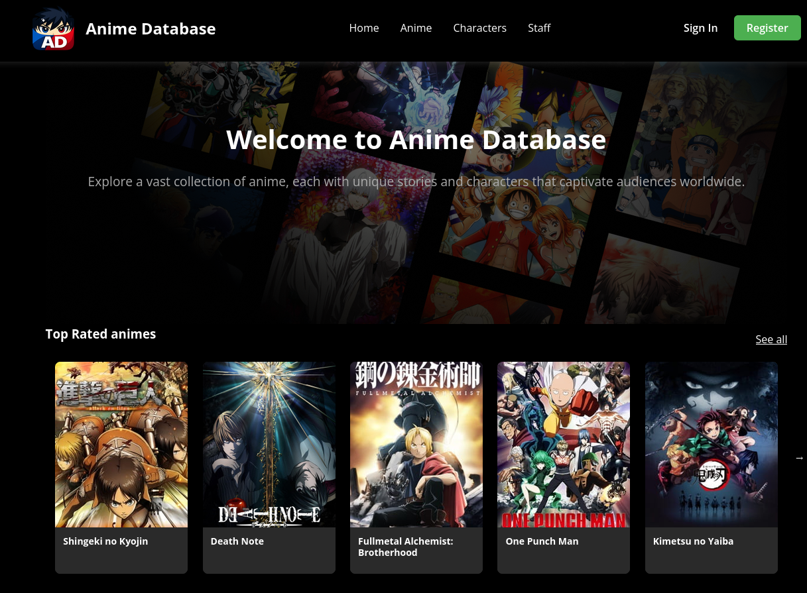
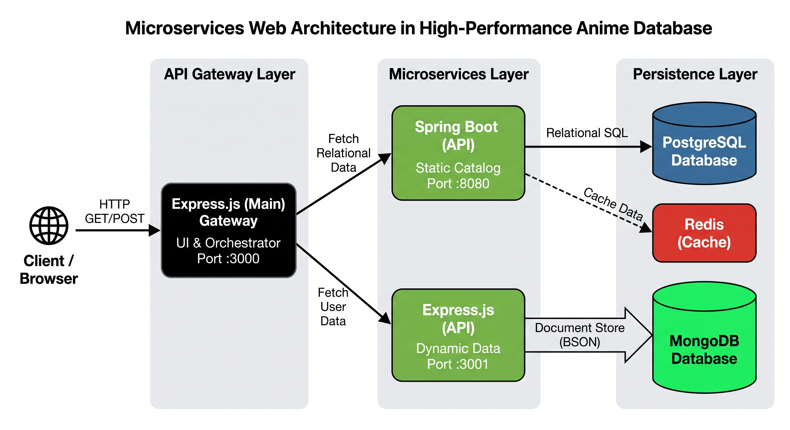
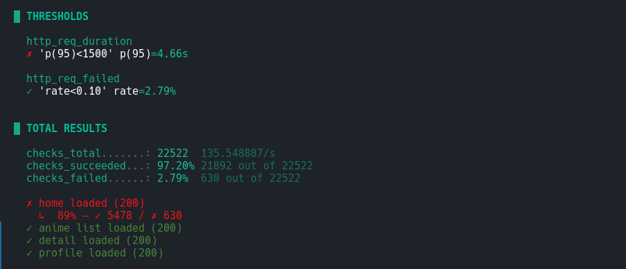

# High-Performance Anime DB 🚀

A scalable, microservices-based web application for browsing and reviewing Anime, originally developed as a university group project and entirely refactored for high performance, concurrency, and security.



## 📑 Table of Contents

- [Project Overview & Data Notice](#-project-overview--data-notice)
- [System Architecture](#️-system-architecture)
- [Frontend & Asynchronous Rendering](#-frontend--asynchronous-rendering)
- [Security](#-security)
- [Performance Optimization & Load Testing (k6)](#-performance-optimization--load-testing-k6)
- [Getting Started](#-getting-started)
  - [Prerequisites](#prerequisites)
  - [Running the Application](#running-the-application)

## 📌 Project Overview & Data Notice

This project utilizes a microservices architecture with polyglot persistence to handle high-traffic scenarios efficiently.

### ⚠️ Important Data Notice:

- The primary dataset is sourced from **MyAnimeList**. Due to its massive size, the actual database dumps are not included in this repository. The dataset is available here: [https://www.kaggle.com/datasets/cristianalasotto/anime-dataset-unito-web-t-project-202526](https://www.kaggle.com/datasets/cristianalasotto/anime-dataset-unito-web-t-project-202526)
- The system is pre-configured with demo accounts for testing purposes. **Note:** Pre-loaded legacy demo users have their passwords set to `null` by default. New accounts created via the web interface will be properly hashed and secured.

## 🏗️ System Architecture

The backend is split into three independent, loosely coupled layers to separate concerns and scale efficiently:

1. **API Gateway & UI Server (Express.js - Port `3000`)**
   - Acts as the main orchestrator and rendering engine.
   - **Zero Heavy Computation:** It delegates all database operations to downstream microservices, ensuring the Node.js event loop remains unblocked.
   - Aggregates JSON responses from data services and renders the HTML.

2. **Dynamic Data Service (Node.js/Express & MongoDB - Port `3001`)**
   - Handles highly mutable, user-generated content (e.g., user ratings, favorite lists, reviews).
   - Ensures high write-throughput using NoSQL document structures.

3. **Static Data Service (Spring Boot & PostgreSQL - Port `8080`)**
   - Manages relational, read-heavy static data (e.g., anime metadata, staff, characters, relationships).
   - Leverages Spring Data JPA for complex relational queries.




## ⚡ Frontend & Asynchronous Rendering

The presentation layer is built using **Handlebars (HBS)** with a focus on DRY (Don't Repeat Yourself) principles and non-blocking data fetching:

- **Layout Engine:** UI components like the Navbar and Footer are centralized in main layout files, preventing redundant code and ensuring consistent rendering across the application.
- **Concurrent API Fetching:** Data retrieval from the Spring Boot and MongoDB microservices is parallelized using `Promise.all()`. This asynchronous pattern guarantees that the gateway does not fetch from databases sequentially, drastically reducing page load times.
- **Partial AJAX Loading:** Heavy localized UI elements (such as user favorite carousels) are fetched asynchronously via client-side requests, loading only the necessary DOM fragments without refreshing the entire page.

## 🔒 Security

Authentication and data protection are implemented using industry-standard practices:

- **Password Hashing:** User passwords are encrypted using `bcryptjs` with a 10-round salt generation before being stored in the database.
- **Stateless Authentication:** Sessions are managed via **JSON Web Tokens (JWT)**, signed with a secret key (`jwt.sign`).
- **Secure Cookie Transmission:** Tokens are stored in `HttpOnly` cookies (`sameSite: 'strict'`) to prevent Cross-Site Scripting (XSS) attacks and secure session persistence.

## 🚀 Performance Optimization & Load Testing (k6)

To validate the architecture's resilience under heavy traffic, the system was subjected to rigorous stress testing using **Grafana k6** and optimized with **Redis**:

- **Redis Caching Layer:** Integrated to absorb read-heavy requests targeted at the PostgreSQL (Spring Boot) service. Repeated queries (like profile fetches) bypass the database, achieving sub-5ms response times.
- **Stress Testing:** The infrastructure was benchmarked with a **2,000 concurrent user Spike Test**.
- **Results:** Despite simulating a local DDoS-level event, the architecture maintained a **96-98% success rate**. The API Gateway queued connections efficiently, protecting the underlying Spring Boot and MongoDB databases from crashing.



## 🚀 Getting Started

The entire infrastructure is containerized. You don't need to manually run `docker-compose up`.

### Prerequisites

- Docker & Docker Compose installed.
- Ports `3000`, `3001`, `5432`, `27017`, and `8080` must be free.

### Running the Application

1. Clone the repository:

```bash
git clone https://github.com/DavideCorrendo/high-performance-anime-db.git
cd high-performance-anime-db
```

2. Launch the automated startup script:

```bash
./start-dev.sh
```

3. Access the services:

- **Web Interface:** `http://localhost:3000`
- **MongoDB API:** `http://localhost:3001`
- **Spring Boot Postgres API:** `http://localhost:8080`